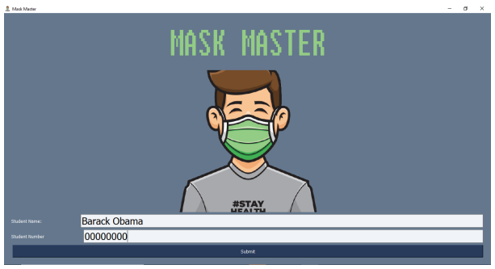
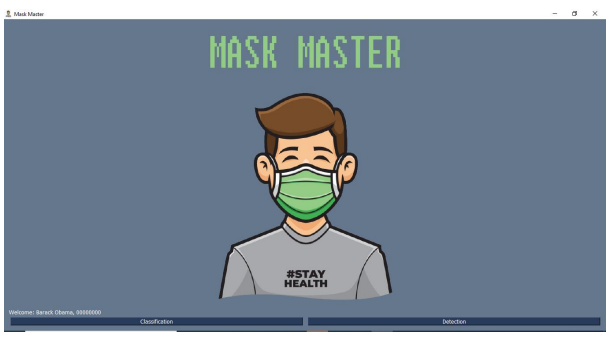
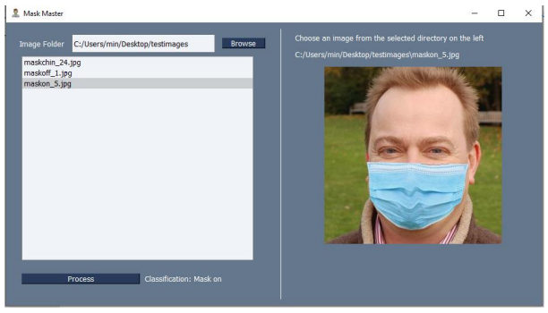
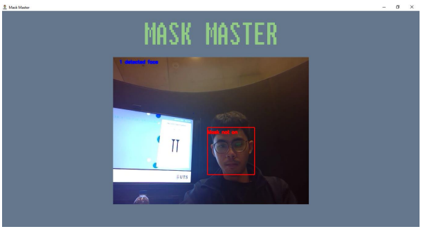
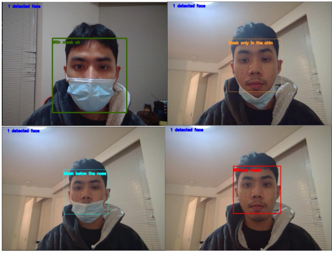
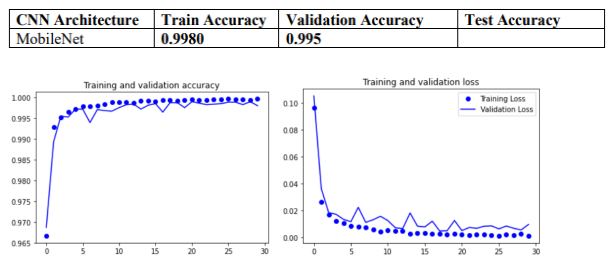

# mask-detection

# GUI Screenshots








# Run
```cmd
python gui.py
```

# Weights
Link to trained weights - [https://drive.google.com/file/d/1jf_6QRKAQlhDP8eB2d8E5DTClA4Djq6b/view?usp=sharing]
